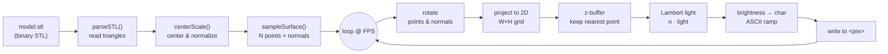

# `// profile` — CRT terminal profile card with a 3D ASCII renderer

> 🌐 [Versão em português](README.md)

A single-page business card: a terminal with CRT styling (scanlines, flicker and
glow) next to a **3D model rendered entirely in ASCII** that you can spin with your
mouse. No Three.js, no WebGL, no dependencies — just plain JavaScript drawing
characters inside a `<pre>`.

The renderer walks the full graphics pipeline by hand: it reads an `.stl` mesh,
samples the surface into points, rotates them with matrices, resolves occlusion
with a z-buffer, computes per-normal lighting, and maps each point's brightness to
an ASCII character.

<!-- ===================================================================
     PREVIEW — add an image or GIF here after pushing the repo:
       1. Open the card in a browser and screen-record yourself spinning the model
       2. Save it as docs/preview.gif
       3. Uncomment the line below
     -->
<!-- <p align="center"></p> -->

## Demo

The simplest way to publish it: enable **GitHub Pages** (Settings → Pages →
Branch `main` / `root`) and the card goes live at
`https://YOUR-USERNAME.github.io/REPO-NAME/`.

## How the renderer works

Everything runs in real time at 30 frames per second, redrawing a grid of
characters on every frame. The flow is:



Step by step:

**1. Mesh parsing (`parseSTL`).** A binary STL file is just an 80-byte header, a
triangle count and, per triangle, a normal plus three vertices. The function reads
those bytes with a `DataView` and returns the list of triangles.

**2. Normalization (`centerScale`).** The model is recentered at the origin and
scaled to fit a known bounding box, so any `.stl` — large or small — shows up the
same way.

**3. Surface sampling (`sampleSurface`).** Instead of rasterizing triangles, the
renderer scatters `POINTS` points across the surface, with probability proportional
to each triangle's area (bigger triangles get more points). Every point also stores
the face **normal**, which the lighting step will use later.

**4. Rotation (per frame).** Points and normals are multiplied by a 3×3 rotation
matrix that combines the automatic spin with the user's drag input (with inertia:
on release, the model keeps spinning and gently slows down).

**5. 2D projection.** Each 3D point becomes a column/row of the grid. The vertical
axis is squashed (`× 0.5`) because terminal characters are taller than they are
wide — without it, the model would look stretched.

**6. Z-buffer.** Several points can land on the same grid cell. The z-buffer keeps,
per cell, only the point nearest to the camera — that's what resolves occlusion
(what's in front hides what's behind).

**7. Lighting (Lambert).** Each point's brightness is the dot product between its
(already rotated) normal and the light direction, clamped between 0 and 1. Surfaces
facing the light read bright; those turning away read dark.

**8. Brightness → ASCII.** That brightness value indexes the ramp `" .:-=+*#%@"`,
from the most "empty" to the most "dense" character. The whole grid is assembled
into a single string and dropped into the `<pre>` at once.

Interaction (drag to spin) uses pointer events feeding the rotation velocity; the
rest of the page — CRT effects, the text "decryption" animation and the audio
player — is a separate layer on top of the renderer.

## Project structure

```
.
├── index.html        → the entire page (HTML + CSS + JS, ~23 KB)
├── assets/
│   ├── model.stl     → 3D mesh rendered as ASCII
│   ├── sprite.gif    → animated sprite at the top of the card
│   └── music.mp3     → background track (optional, see below)
└── README.md
```

> The three files in `assets/` used to be embedded as base64 inside the HTML
> (bloating the file to ~13 MB). Splitting them out made `index.html` readable and
> easy to version-control.

## Running locally

Because the card loads the `.stl` via `fetch()`, it needs to be served over HTTP
(opening the file directly through `file://` won't load the model — in that case a
code-generated fallback model kicks in, so the page never breaks). To see the full
version, spin up a local server:

```bash
# Python 3
python3 -m http.server 8000
# then open http://localhost:8000
```

## Customizing

Almost everything that changes per person lives in a single `CONFIG` block at the
top of the `<script>` in `index.html`, marked with **`EDITE AQUI`** ("edit here"):

```js
const CONFIG = {
  termTitle:  "Good evening @user",
  handle:     "Your Name",
  role:       "• Role • Tagline",
  bio:        "One line about you",
  promptText: "Your footer line.",

  links: [
    { cmd: "github", val: "@username", url: "https://github.com/username" },
    // add/remove as many as you like
  ],

  stlUrl: "assets/model.stl",   // swap for any .stl in assets/
  // ...rendering fine-tuning below
};
```

To change the **3D model**, drop another `.stl` file into `assets/` and update
`stlUrl`. To change or remove the **music**, replace `assets/music.mp3` (or delete
the file and the `<audio>` tag for a lighter repo).

## Tech

Plain HTML, CSS and JavaScript — no frameworks, no dependencies. Fonts come from
Google Fonts (`Share Tech Mono` and `VT323`).
